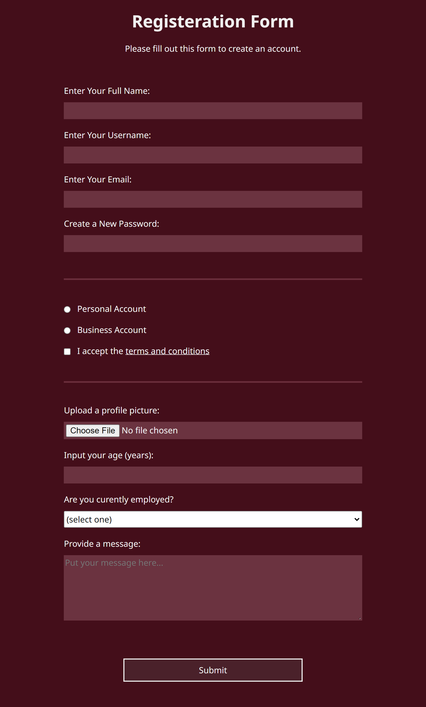

# Registration-form

## Project Description

Registration form using HTML and CSS

## Screenshot

## My Process

### Built with

- Semantic HTML5 markup
- CSS custom properties (variables)
- Mobile-first workflow

## Useful resources

When building this registeration form I used this resource listed below.

- [Color Constrast Picker](https://coolors.co/contrast-checker/112a46-acc8e5)

## Author

- Github - [@bccpadge](https://github.com/bccpadge)
- Youtube - [@rnpadgett1231](https://www.youtube.com/channel/UCyYw_uuv7x6pKUWygX21GYg)

## Acknowledgement

This form may look for familiar, I took inspiration from the [freecodecamp website](https://www.freecodecamp.org/) building a registeration form under the curriculum of Responsive Web Design.
